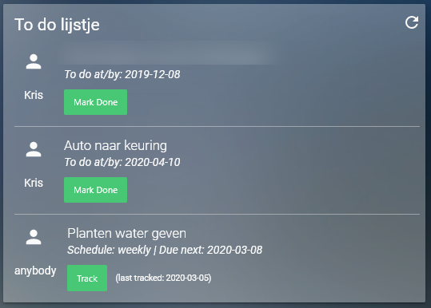

# Tasks and chores card for Grocy

This card exposes the Tasks and Chores you have set in Grocy and allows you to mark tasks as done and chores as executed/tracked.



The card uses the Bulma css framework for the layout and some basic styling. As always you can make your own styles with card-mod.
When you track a chore or complete a task the card will automatically refresh, but this will take some time as the Grocy api works pretty slowly. You can also refresh the data manually at any time using the refresh icon

## Installation and configuration

1. This card depends on the accompanying [Grocy api-wrapper](https://github.com/kdw2060/hassio-addons/tree/master/hassio-addon-grocy-api-wrapper) I made, so make sure to install this first.
2. Copy the .js file to the config > www > custom_cards folder of Home Assistant (the folder path may be different on your system)
3. Add these lines to your `ui-lovelace.yaml` file:
```yaml
- url: /local/custom_cards/grocy-chores-tasks-card.js?v=0.001
  type: module
```
4. Include the card in a lovelace view:
```yaml
cards:
  - type: custom:grocy-chores-tasks
    title: Title goes here
    grocyApiWrapperUrl: *api wrapper url including port* e.g. 'http://192.168.1.5:3003'
```
