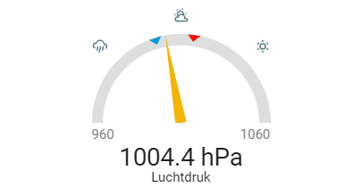

# My custom Home Assistant Lovelace cards

## nmbs-myroute-card
A card to display the next trains leaving a Belgian train station for a given route.

| Standard (no styling) | Styled
| --- | ---
|  | 

[More info](nmbs-routeboard/readme.md)

## barometer-gauge-card
A card for air pressure sensors that's styled as a barometer.

| Standard style | Needle style
| --- | ---
|  | 

[More info](barometer-gauge/readme.md)