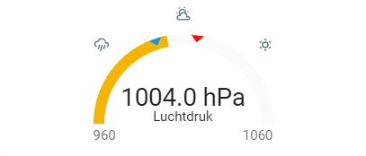

# barometer-gauge-card
A custom card for air pressure sensors in Home Assistant, styled as a barometer.
Based on [the standard gauge card](https://github.com/custom-cards/gauge-card). The blue/red markers indicate the recently recorded low/high. When hovered they show the actual values. Comes in 2 style variants:

| Standard style | Needle style
| --- | ---
|  | 

## Prerequisites
This card relies on the home assistant api. Make sure:
* your Home Assistant instance can be accessed via `http://hassio.local:8123`
* you have created an api token and set the `apitoken` option (see options)

If these criteria are not met the card will not work.


## Usage
Upload to your custom cards folder of your home assistant instance. Reference it into your lovelace configuration by adding these lines to the resources section (adapt the folder name if necessary):

```yaml
- url: /local/custom_cards/barometer-gauge-card.js
  type: js
```

Add a custom card in your lovelace yaml and set its options: 
```yaml
- type: "custom:barometer-gauge-card"
  entity: ...
  apitoken: "..."
  minmaxhistory: 3
  ...
```

## Options

| Name | Type | Needed? | Value
| ---- | ---- | ------- | -----------
| type | string | **Required** | `custom:"barometer-gauge-card"`
| entity | string | **Required** | `sensor.xyz`
| minmaxhistory | number | **Required** | e.g.: `3` (Number of days to go back in history for the blue and red markers. What value works for you also depends on other settings you might have in your config.)
| apitoken | string | **Required** | `"api-token"` ([request a Long Lived Access Token via your profile page](https://www.home-assistant.io/docs/authentication/#your-account-profile))
| attribute | string | optional | If set, this attribute of the entity is used, instead of its state
| title | string | optional | Name to display on card
| measurement | string | optional | If not set, uses the unit_of_measurement on the entity
| needle | bool | optional | `false` or `true` set to true for the alternative styling
| scale | string | optional | Base value for graph visual size
| severity | object | optional | Severity object. See below

Severity object (use numbers between 960 and 1060):

| Name | Type | Default | Description
| ---- | ---- | ------- | -----------
| red | number | **Required** | Value from which to start red color
| green | number | **Required** | Value from which to start green color
| amber | number | **Required** | Value from which to start amber color
